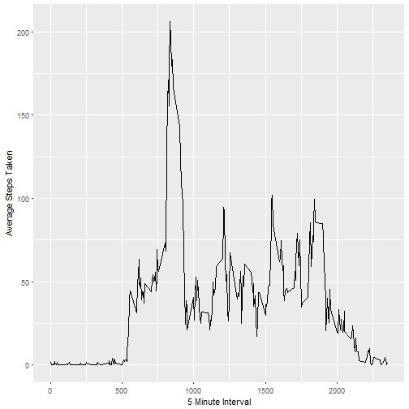
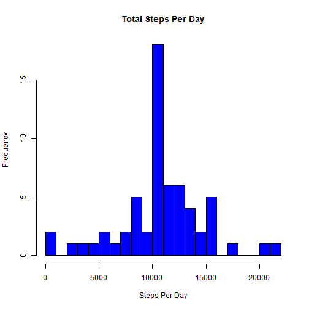
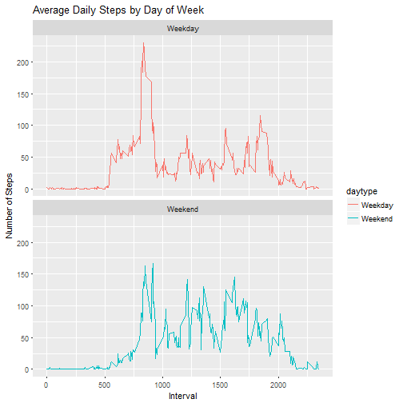

#Introduction
This assignment explores data about personal movement. The data are taken from personal acitivty monitoring devices. 

The first step is to load the data:

```r
##ensure the data is downloaded in a readable location
##read the data
mydata<-read.csv("activity.csv")
```

#Preprocess Data - Remove NA's 
To tidy the data a bit, we will remove any NA values. In addtion we need to change the date field which is currently a factor into a date field.

```r
##remove NAs from the data set
mydata<- mydata[!is.na(mydata$steps),]
##create a new variable for the day of the week
mydata$day <- weekdays(as.Date(mydata$date))
##convert the current date field (which is a factor) into a date field
mydata$date<- as.POSIXct(mydata$date, format="%Y-%m-%d")
```

#What is the mean total number of steps take per day?
1. Cacludate the total number of steps taken each day.

```r
TotalSteps <- aggregate(steps ~ date, mydata, sum)
```
2. Create a historgram of the total number of steps take each day

```r
hist(TotalSteps$steps, col="blue", breaks=20, xlab="Steps Per Day", ylab="Frequency",
     main="Total Steps Per Day")
```


3. Calcualte the mean

```r
calcmean <- as.integer(mean(TotalSteps$steps))
calcmedian <- as.integer(median(TotalSteps$steps))
```

The mean is __10766__ and the median is __10765__

#What is the Average Daily Activity Pattern?
1. Make a time series plot (i.e. type = "l") of the 5-minute interval (x-axis) and the average number of steps taken, averaged across all days (y-axis)

```r
Interval_steps <- aggregate(steps ~ interval, mydata, mean)
```


```r
library(ggplot2)
ggplot(data=Interval_steps, aes(x=interval, y=steps)) + geom_line() + xlab("5 Minute Interval")+ ylab("Average Steps Taken")
```



2. Which 5-minute interval, on average across all the days in the dataset, contains the maximum number of steps?

```r
Interval_max <- Interval_steps[which.max(Interval_steps$steps),1]
Steps_max <- as.integer(max(Interval_steps$steps))
```

The interval with the max steps is 835 with a step count of 206.

#Imputing Missing Values
1. Calculate and report the total number of missing values in the dataset (i.e. the total number of rows with NAs)

```r
originaldata<-read.csv("activity.csv")
missingdata<-sum(is.na(originaldata))
```
There are 2304 missing values in the dataset.

2. Devise a strategy for filling in all of the missing values in the dataset. The strategy does not need to be sophisticated. For example, you could use the mean/median for that day, or the mean for that 5-minute interval, etc.

Since there are 2304 missing values in the dataset, a new dataset will be created replacing all missing values with average 5-minute interval value.

3. Create a new dataset that is equal to the original dataset but with the missing data filled in.

```r
newmissing <- is.na(originaldata$steps)
interval_avg <- tapply(originaldata$steps, originaldata$interval, mean, na.rm=TRUE, simplify=T)
originaldata$steps[newmissing] <- interval_avg[as.character(originaldata$interval[newmissing])]
```

4. Make a histogram of the total number of steps taken each day and Calculate and report the mean and median total number of steps taken per day. Do these values differ from the estimates from the first part of the assignment? What is the impact of imputing missing data on the estimates of the total daily number of steps?

```r
NewTotalSteps <- aggregate(steps ~ date, originaldata, sum)
hist(NewTotalSteps$steps, col="blue", breaks=20, xlab="Steps Per Day", ylab="Frequency",
     main="Total Steps Per Day")
```




```r
newcalcmean <- as.integer(mean(NewTotalSteps$steps))
newcalcmedian <- as.integer(median(NewTotalSteps$steps))
```

Using the imputed data, the average number of steps is __10766__ and the median is __10766__

Imputing values for the missing values had no impact on the mean and only a 1 step difference on the median. The histogram looked just like the original. In this particular situation the mssing data had very little impact on the reporring.

#Are there differences in activity patterns between weekdays and weekends?
1. Create a new factor variable in the dataset with two levels – “weekday” and “weekend” indicating whether a given date is a weekday or weekend day.

```r
##create a new variable for the day of the week
originaldata$day <- weekdays(as.Date(originaldata$date))
##convert the current date field (which is a factor) into a date field
originaldata$date<- as.POSIXct(originaldata$date, format="%Y-%m-%d")
##create a new factor variable for weekdays and weekends
originaldata$daytype<-as.factor(ifelse (originaldata$day=="Sunday"|originaldata$day=="Saturday", "Weekend","Weekday"))

##Subset data for plots
Interval_avg <- aggregate(steps ~ interval + daytype, data=originaldata, mean)
```
2. Make a panel plot containing a time series plot (i.e. type="l") of the 5-minute interval (x-axis) and the average number of steps taken, averaged across all weekday days or weekend days (y-axis). See the README file in the GitHub repository to see an example of what this plot should look like using simulated data.

```r
ggplot(Interval_avg, aes(x =interval , y=steps, color=daytype)) +
       geom_line() +
       labs(title = "Average Daily Steps by Day of Week", x = "Interval", y = "Number of Steps") +
       facet_wrap(~daytype, ncol = 1, nrow=2)
```


